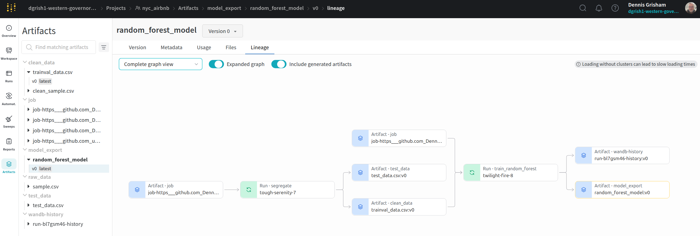

# Build an ML Pipeline for Short-Term Rental Prices in NYC
You are working for a property management company renting rooms and properties for short periods of 
time on various rental platforms. You need to estimate the typical price for a given property based 
on the price of similar properties. Your company receives new data in bulk every week. The model needs 
to be retrained with the same cadence, necessitating an end-to-end pipeline that can be reused.

In this project you will build such a pipeline.

## Table of contents

- [Preliminary steps](#preliminary-steps)
  * [Fork the Starter Kit](#fork-the-starter-kit)
  * [Create environment](#create-environment)
  * [Get API key for Weights and Biases](#get-api-key-for-weights-and-biases)
  * [The configuration](#the-configuration)
  * [Running the entire pipeline or just a selection of steps](#Running-the-entire-pipeline-or-just-a-selection-of-steps)
  * [Pre-existing components](#pre-existing-components)

## Preliminary steps

### Supported Operating Systems

This project is compatible with the following operating systems:

- **Ubuntu 22.04** (Jammy Jellyfish) - both Ubuntu installation and WSL (Windows Subsystem for Linux)
- **Ubuntu 24.04** - both Ubuntu installation and WSL (Windows Subsystem for Linux)
- **macOS** - compatible with recent macOS versions

Please ensure you are using one of the supported OS versions to avoid compatibility issues.

### Python Requirement

This project requires **Python 3.10**. Please ensure that you have Python 3.10 installed and set as the default version in your environment to avoid any runtime issues.

### Fork the Starter kit
Go to [https://github.com/udacity/Project-Build-an-ML-Pipeline-Starter](https://github.com/udacity/Project-Build-an-ML-Pipeline-Starter)
and click on `Fork` in the upper right corner. This will create a fork in your Github account, i.e., a copy of the
repository that is under your control. Now clone the repository locally so you can start working on it:

```
git clone https://github.com/[your github username]/Project-Build-an-ML-Pipeline-Starter.git
```

and go into the repository:

```
cd Project-Build-an-ML-Pipeline-Starter
```
Commit and push to the repository often while you make progress towards the solution. Remember 
to add meaningful commit messages.

### Create environment
Make sure to have conda installed and ready, then create a new environment using the ``environment.yaml``
file provided in the root of the repository and activate it:

```bash
> conda env create -f environment.yml
> conda activate nyc_airbnb_dev
```

### Get API key for Weights and Biases
Let's make sure we are logged in to Weights & Biases. Get your API key from W&B by going to 
[https://wandb.ai/authorize](https://wandb.ai/authorize) and click on the + icon (copy to clipboard), 
then paste your key into this command:

```bash
> wandb login [your API key]
```

You should see a message similar to:
```
wandb: Appending key for api.wandb.ai to your netrc file: /home/[your username]/.netrc
```

### Weights & Biases Project

This project logs all pipeline runs to Weights & Biases under the following project:

- Project name: **nyc_airbnb**
- Link: [https://wandb.ai/dgrish1-western-governors-university/nyc_airbnb](https://wandb.ai/dgrish1-western-governors-university/nyc_airbnb)

> Note: Due to organization account settings, this project is currently Team-visible.


### The configuration
As usual, the parameters controlling the pipeline are defined in the ``config.yaml`` file defined in
the root of the starter kit. We will use Hydra to manage this configuration file. 
Open this file and get familiar with its content. Remember: this file is only read by the ``main.py`` script 
(i.e., the pipeline) and its content is
available with the ``go`` function in ``main.py`` as the ``config`` dictionary. For example,
the name of the project is contained in the ``project_name`` key under the ``main`` section in
the configuration file. It can be accessed from the ``go`` function as 
``config["main"]["project_name"]``.

NOTE: do NOT hardcode any parameter when writing the pipeline. All the parameters should be 
accessed from the configuration file.

### Running the entire pipeline or just a selection of steps

**First Run Quickstart (Important for Reproducibility)**
On a fresh clone or grader's environment, you must set environment variables before running the full pipeline. 
Run these commands from the project root:

```bash
wandb login [your API key]   # Only needs to be done once
unset WANDB_MODE             # Ensure we are online
export WANDB_ENTITY=dgrish1-western-governors-university
export WANDB_PROJECT=nyc_airbnb
export MLFLOW_TRACKING_URI="file://$PWD/mlruns"

mlflow run . --experiment-name nyc_airbnb_pipeline \
  -P steps=download,basic_cleaning,segregate,data_check,train_random_forest,register_model,test_regression_model
```

This guarantees that MLflow creates the experiment locally and W&B logs artifacts online, avoiding the `Could not find experiment with ID 0` error.

In order to run the pipeline when you are developing, you need to be in the root of the starter kit, 
then you can execute as usual:

```bash
>  mlflow run .
```
This will run the entire pipeline.

When developing it is useful to be able to run one step at the time. Say you want to run only
the ``download`` step. The `main.py` is written so that the steps are defined at the top of the file, in the 
``_steps`` list, and can be selected by using the `steps` parameter on the command line:

```bash
> mlflow run . -P steps=download
```
If you want to run the ``download`` and the ``basic_cleaning`` steps, you can similarly do:
```bash
> mlflow run . -P steps=download,basic_cleaning
```
You can override any other parameter in the configuration file using the Hydra syntax, by
providing it as a ``hydra_options`` parameter. For example, say that we want to set the parameter
modeling -> random_forest -> n_estimators to 10 and etl->min_price to 50:

```bash
> mlflow run . \
  -P steps=download,basic_cleaning \
  -P hydra_options="modeling.random_forest.n_estimators=10 etl.min_price=50"
```

### Pre-existing components
In order to simulate a real-world situation, we are providing you with some pre-implemented
re-usable components. While you have a copy in your fork, you will be using them from the original
repository by accessing them through their GitHub link, like:

```python
_ = mlflow.run(
                f"{config['main']['components_repository']}/get_data",
                "main",
                version='main',
                env_manager="conda",
                parameters={
                    "sample": config["etl"]["sample"],
                    "artifact_name": "sample.csv",
                    "artifact_type": "raw_data",
                    "artifact_description": "Raw file as downloaded"
                },
            )
```
where `config['main']['components_repository']` is set to 
[https://github.com/udacity/Project-Build-an-ML-Pipeline-Starter/tree/main/components](https://github.com/udacity/Project-Build-an-ML-Pipeline-Starter/tree/main/components).
You can see the parameters that they require by looking into their `MLproject` file:

- `get_data`: downloads the data. [MLproject](https://github.com/udacity/Project-Build-an-ML-Pipeline-Starter/blob/main/components/get_data/MLproject)
- `train_val_test_split`: segregate the data (splits the data) [MLproject](https://github.com/udacity/Project-Build-an-ML-Pipeline-Starter/blob/main/components/train_val_test_split/MLproject)

## In case of errors

### Environments
When you make an error writing your `conda.yml` file, you might end up with an environment for the pipeline or one
of the components that is corrupted. Most of the time `mlflow` realizes that and creates a new one every time you try
to fix the problem. However, sometimes this does not happen, especially if the problem was in the `pip` dependencies.
In that case, you might want to clean up all conda environments created by `mlflow` and try again. In order to do so,
you can get a list of the environments you are about to remove by executing:

```
> conda info --envs | grep mlflow | cut -f1 -d" "
```

If you are ok with that list, execute this command to clean them up:

**_NOTE_**: this will remove *ALL* the environments with a name starting with `mlflow`. Use at your own risk

```
> for e in $(conda info --envs | grep mlflow | cut -f1 -d" "); do conda uninstall --name $e --all -y;done
```

This will iterate over all the environments created by `mlflow` and remove them.

### MLflow & Wandb

If you see the any error while running the command:

```
> mlflow run .
```

Please, make sure all steps are using **the same** python version and that you have **conda installed**. Additionally, *mlflow* and *wandb* packages are crucial and should have the same version.


## License

[License](LICENSE.txt)

---

## Model Reproduction Instructions

To reproduce the final tuned Random Forest model and predictions:

```python
import joblib

# Load the saved model from disk
loaded_model = joblib.load("random_forest_best_model.joblib")

# Predict again using the reloaded model
y_loaded_pred = loaded_model.predict(X_test)

# Confirm predictions match the original best model
print("Match with best_rf:", (y_loaded_pred == y_pred_best).all())
```
## Note on Reproducing Predictions

The `X_test` variable must be re-created from the **same data processing pipeline** used during training.

This includes:
- All cleaning steps (e.g., handling nulls, removing unused columns)
- Feature engineering (e.g., `reviews_per_year`, `is_available`)
- One-hot encoding of categorical features

If the pipeline is not followed exactly, the shape or feature set of `X_test` will mismatch what the model expects, causing prediction errors.

---


This appendix gives a clear, step-by-step look at the whole ML pipeline — showing the commands to run, what files go in and out, and tips for retraining and putting the model into use.

## Appendix — End-to-End ML Pipeline

This appendix outlines the complete, runnable pipeline that created the final Random Forest model.
It includes exact commands for running, evaluating, registering, promoting, and reproducing inference.
All configuration values are stored in **Hydra** (`config.yaml`) — nothing is hard-coded in the step scripts.

**Environment & Tooling**

- OS: Ubuntu 22.04
- Python: 3.10
- Tools: `conda`, `mlflow`, `wandb`

```bash
conda activate nyc_airbnb_dev
wandb login YOUR_API_KEY
export WANDB_ENTITY=<your_wandb_entity>
export WANDB_PROJECT=nyc_airbnb
```


### A. Quickstart: Run the whole pipeline
To execute the entire sequence of steps in one go, run the command below. This will process the data from download through cleaning, splitting, validation checks, model training, model registration, and final evaluation on the test set:

```bash
mlflow run . \
  -P steps=download,basic_cleaning,segregate,data_check,train_random_forest,register_model,test_regression_model
```

If you only want to run certain parts of the pipeline, you can list just those steps (in the correct order) in the `-P steps=` argument.


### B. Pipeline Steps and Their Inputs/Outputs

Below is a breakdown of the main pipeline stages, what each one does, and what goes in and out of them.

1. **download**
   - **What it does:** Retrieves the initial CSV dataset (sample) using the shared `get_data` component and stores it as a Weights & Biases artifact.
   - **Input source:** `config.etl.sample` (defined in `config.yaml`)
   - **Output artifact:** `sample.csv` (artifact type: `raw_data`, logged to W&B)

2. **basic_cleaning**
   - **What it does:** Applies cleaning rules — removes listings with prices outside the range in `etl.min_price` and `etl.max_price`, converts date fields to proper datetime objects, and drops or renames columns as configured.
   - **Input artifact:** `sample.csv` (from the download step, pulled from W&B)
   - **Output artifact:** `clean_sample.csv` (artifact type: `clean_data`, logged to W&B)

3. **segregate**
   - **What it does:** Splits the cleaned dataset into training, validation, and test subsets.
   - **Input artifact:** `clean_sample.csv` (from the basic_cleaning step, pulled from W&B)
   - **Output files (local):**
     - `outputs/train_data.csv`
     - `outputs/test_data.csv`
   - *(Note: In some runs, `trainval_data.csv` and `test_data.csv` may also be logged to W&B.)*

4. **data_check**
   - **What it does:** Runs **data tests** (PyTest assertions) on the cleaned/split dataset to verify schema, value ranges, and categorical levels.
   - **Input:** `outputs/train_data.csv` (and/or `clean_sample.csv`)
   - **Behavior:** Fails early if checks do not pass, preventing training on bad data.

5. **train_random_forest**
   - **What it does:** Fits a **scikit-learn Pipeline** (preprocessing + `RandomForestRegressor`).
   - **Inputs:** `outputs/train_data.csv` (+ hyperparameters from `config.modeling.random_forest.*`)
   - **Outputs (MLflow run):**
     - Logged model artifact (e.g., `random_forest_model_YYYYMMDD_HHMMSS`)
     - Metrics (`R²`, `MAE`, etc.)
     - (Optional) `outputs/params.json` with run/params summary

6. **register_model**
   - **What it does:** Registers the trained model in the **MLflow Model Registry** under a consistent name.
   - **Input:** Latest successful training run’s model URI
   - **Outputs (local):**
     - `outputs/last_registered_model.json` (points to the newly registered version)
     - `outputs/params.json` (training run id)

7. **test_regression_model**
   - **What it does:** Evaluates the **registered** model on the held-out **test set** against predefined gate thresholds.
   - **Inputs:**
     - `models:/<registered_name>/<version-or-stage>` (resolved internally)
     - `outputs/test_data.csv`
     - Gate thresholds (passed as command-line arguments, not in config.yaml)
   - **Outputs (local):** `outputs/eval_metrics.json` with `R²`/`MAE` and pass/fail status
   - **Default gate (example):** `R²` ≥ **0.50**, `MAE` ≤ **40.0** (defaults when running the evaluation step)

**Pipeline Lineage (W&B Graph View)**
Here is the pipeline lineage visualization from W&B, showing all steps connected end-to-end.



### C. Adjusting Parameters with Hydra (Avoid hard-coding)

All pipeline settings come from `config.yaml`, so nothing should be hard-wired into the scripts.
If you need to change a value for a single run, you can pass overrides directly from the command line.

**Example:**
```bash
mlflow run . \
  -P steps=download,basic_cleaning,segregate,train_random_forest \
  -P hydra_options="etl.min_price=10 etl.max_price=350 modeling.random_forest.n_estimators=200 modeling.random_forest.max_depth=25"
```

**Key areas in `config.yaml` you might override:**
- **Main controls (main):** `main.project_name`, `main.experiment_name`, `main.components_repository`, `main.random_seed`
- **ETL controls (etl):** `etl.min_price`, `etl.max_price`, `etl.sample`
- **Split controls (segregate):** `segregate.test_size`, `segregate.random_seed`, `segregate.stratify_by`
- **Model training (modeling):** General: `modeling.val_size`, `modeling.random_seed`, `modeling.stratify_by`; Random Forest (`modeling.random_forest.*`): `n_estimators`, `max_depth`, `min_samples_split` 
- **Evaluation gates:** Thresholds are R² ≥ 0.50 and MAE ≤ 40.0. These are currently passed as command-line flags when running `test_regression_model`, not stored in config.yaml.


### D. Model Selection and Optional Hyperparameter Optimization (HPO)

You can fine-tune the model in two ways:

1. **Manual tuning** — Run the `train_random_forest` step with updated parameters, then follow it with `register_model` and `test_regression_model` to evaluate and (if successful) register the new version.

**Example workflow for manual tuning:**
```bash
# Re-train the model with updated parameters
mlflow run . -P steps=train_random_forest \
  -P hydra_options="modeling.random_forest.n_estimators=300"

# Register the newly trained model
mlflow run . -P steps=register_model

# Run the evaluation gate on the test set
mlflow run . -P steps=test_regression_model
```

2. **Automated HPO** — Add an extra step (such as `hpo_random_search`) that searches across multiple `modeling.random_forest.*` parameter combinations, records each run in MLflow, and identifies the best-performing configuration. You can then pass that best run’s URI to `register_model`.


### E. Reproducible Inference (Using a Local Artifact or a Registered Model)

Two common approaches are available for generating predictions in a way that matches the environment and preprocessing used during training.

#### E.1 Using the **Registered Production Model** (recommended)

Leverages the model’s stored Conda environment to ensure the same library versions are used at inference time:

```bash
mlflow models predict \
  -m models:/nyc_airbnb_random_forest/Production \
  --env-manager conda \
  --input-path outputs/test_data.csv \
  --content-type csv \
  --output-path outputs/preds_prod.csv
```

#### E.2 Using the **Local Best Model File**

If you have a locally saved version of the trained model (`random_forest_best_model.joblib`), you can load it directly.
It is critical that the `X_test` data is prepared with the exact same preprocessing pipeline used during training:

```python
import joblib
import pandas as pd

# Prepare X_test with identical preprocessing to the training phase
X_test = pd.read_csv("outputs/test_data.csv").drop(columns=["price"])
loaded_model = joblib.load("random_forest_best_model.joblib")
y_loaded_pred = loaded_model.predict(X_test)
print("Predictions shape:", y_loaded_pred.shape)
```

If a local model file is not available, or if version mismatches occur, use the **Registered Production Model** method in E.1 to ensure reproducibility.


### F. Promoting a Model in the MLflow Model Registry

After a model version has passed the evaluation gate, you can move it through the registry stages to control its lifecycle.

#### F.1 Promote a Passing Version to **Staging**

Use the code below to transition a specific version (replace the example version number with your passing one) into the **Staging** stage.
This keeps previous Staging versions active unless `archive_existing_versions` is set to `True`.

```python
from mlflow.tracking import MlflowClient

name = "nyc_airbnb_random_forest"
ver = "6"  # replace with the version number that passed the evaluation gate

c = MlflowClient()
c.transition_model_version_stage(name=name, version=ver, stage="Staging", archive_existing_versions=False)
c.update_model_version(
    name=name,
    version=ver,
    description="Passed evaluation gate on 2025-08-14 (example run): R²≈0.56, MAE≈33.8 → moved to Staging."
)

# Optional alias (supported in newer MLflow versions)
try:
    c.set_registered_model_alias(name, "champion", ver)
except Exception:
    pass
```

#### F.2 Promote from **Staging** to **Production**

Once validated in Staging, the same version can be promoted to **Production**.
This action will archive any previously active Production versions by default.

```python
from mlflow.tracking import MlflowClient

NAME = "nyc_airbnb_random_forest"
VER = "6"  # version currently in Staging

c = MlflowClient()
c.transition_model_version_stage(NAME, VER, stage="Production", archive_existing_versions=True)
c.update_model_version(
    NAME,
    VER,
    description="Promoted to Production on 2025-08-14 (example) after passing all evaluation checks."
)
```


### G. Release Process — What Gets Logged and Where to Find It

The pipeline records its outputs in three main places:

- **Weights & Biases (W&B) Artifacts**
  - `sample.csv` — raw dataset as originally downloaded
  - `clean_sample.csv` — cleaned dataset after preprocessing
  - *(Sometimes also)* `trainval_data.csv` and `test_data.csv` if those are uploaded

- **Local `outputs/` Directory**
  - `train_data.csv` and `test_data.csv` — final split datasets used for training and testing
  - `params.json` — contains training run details and parameter values
  - `last_registered_model.json` — URI pointing to the most recently registered model version
  - `eval_metrics.json` — evaluation results, including R², MAE, and pass/fail status against thresholds
  - `preds_prod.csv` — prediction results (only present if `mlflow models predict` was executed)

- **MLflow Tracking / Model Registry**
  - **Registered Model Name:** `nyc_airbnb_random_forest`
  - **Versions:** automatically incremented with each registration; lifecycle stages move from `None` → `Staging` → `Production`
  

### H. Weekly Retraining with New Data and Built-In Failure Recovery

When new data arrives each week, the same pipeline can be reused without modification:

```bash
# Step 1: Update config.etl.sample (or the data source in the component) 
#         so it points to the new weekly dataset.
# Step 2: Run the pipeline from start to finish:
mlflow run . \
  -P steps=download,basic_cleaning,segregate,data_check,train_random_forest,register_model,test_regression_model
```

**Automatic Evaluation Gate:**
- If the gate **fails** (for example, `R²` falls below the minimum or `MAE` exceeds the maximum), the pipeline stops automatically.
  - Review `outputs/eval_metrics.json` for details and check the associated run in MLflow/W&B.
  - Tweak model parameters such as `n_estimators`, `max_depth`, or selected features, then re-run only the later steps:
    ```bash
    mlflow run . -P steps=train_random_forest -P hydra_options="modeling.random_forest.n_estimators=400"
    mlflow run . -P steps=register_model
    mlflow run . -P steps=test_regression_model
    ```

- If the gate **passes**, follow the process in Section F to promote the version through **Staging → Production**.

This structure allows for quick recovery from a failed retraining without having to repeat earlier, more time-consuming pipeline stages.


### I. Rubric Alignment Checklist

My Rubric project requirement checks:

- **Hydra-based configuration** — All parameters are stored in `config.yaml` and can be overridden at runtime using `-P hydra_options=...`.
- **Data preparation** — Includes price outlier removal, data type corrections, and date parsing.
- **Automated data validation** — The `data_check` step runs assertion tests to catch schema or value issues early.
- **Consistent data splitting** — The `segregate` step uses a fixed `random_seed` for reproducible splits.
- **Model development** — The `train_random_forest` step logs metrics, hyperparameters, and model artifacts to MLflow.
- **Hyperparameter tuning / model selection** — Can be done by re-running `train_random_forest` with new settings or adding an HPO step.
- **Test set evaluation** — The default thresholds are R² ≥ 0.50 and MAE ≤ 40.0 (set as command-line arguments when running the evaluation).
- **Model registration and lifecycle management** — The `register_model` step and MLflow commands handle transitions between Staging and Production.
- **Reproducible predictions** — Achieved by running `mlflow models predict --env-manager conda` with the registered Production model.
- **Release tracking** — Outputs are stored in W&B, MLflow’s tracking/registry, and the local `outputs/` folder for hand-off. W&B runs and artifacts are logged under the project nyc_airbnb (see link above).
- **Scheduled retraining with safety checks** — The same pipeline supports weekly updates with a pass/fail gate and targeted recovery steps.


### J. Troubleshooting

- **Library version conflicts (scikit-learn / pandas)** — If you see errors related to mismatched versions, run predictions with the model’s saved environment by adding `--env-manager conda` to your `mlflow models predict` command.
- **Missing W&B artifacts** — Confirm that you are logged in with `wandb login` and that both `WANDB_ENTITY` and `WANDB_PROJECT` environment variables are set correctly.
- **Conda environment issues** — If old `mlflow-*` environments are causing problems, remove them to start fresh. Instructions are in the “In case of errors” section higher up in this document.
- **Evaluation gate failures** — When the model fails the R² or MAE thresholds, review `eval_metrics.json` and your MLflow/W&B run details. Adjust parameters under `modeling.random_forest.*` and retrain starting from the `train_random_forest` step.


### Weekly Data Run — v1.0.0 → v1.0.1 (Rubric Check)

- v1.0.0 run on `sample2.csv` **failed** at `data_check` (`test_proper_boundaries`), demonstrating the data issue.
- Implemented NYC bounding box filtering in `src/basic_cleaning/run.py`.
- Released **v1.0.1** and re-ran on `sample2.csv`: `data_check` **passed**, model trained and **registered as version 2**, gates **passed** (R² ≈ 0.57, MAE ≈ 33.6).
